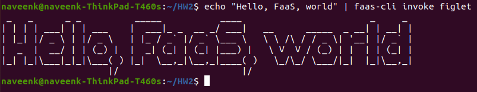
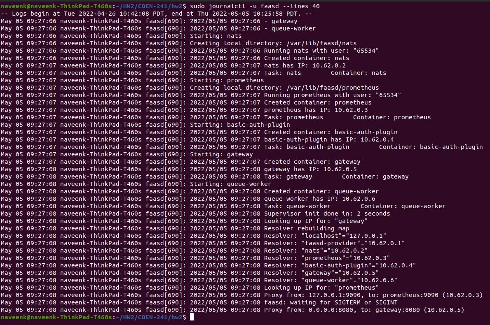
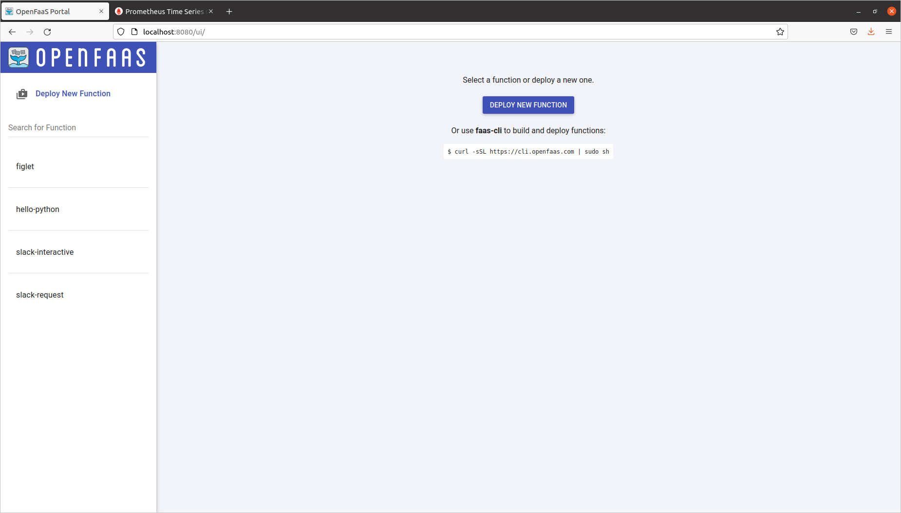
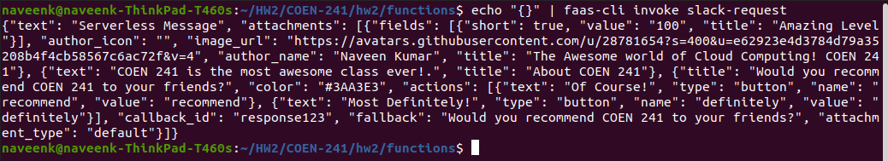
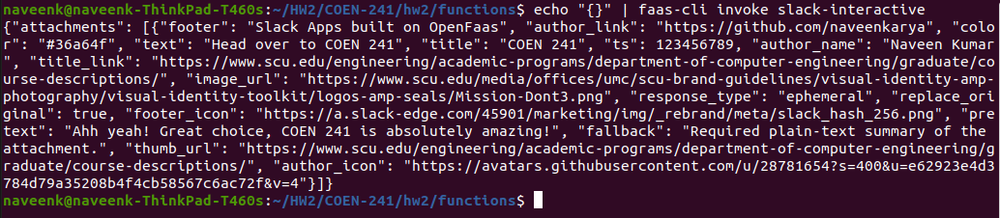
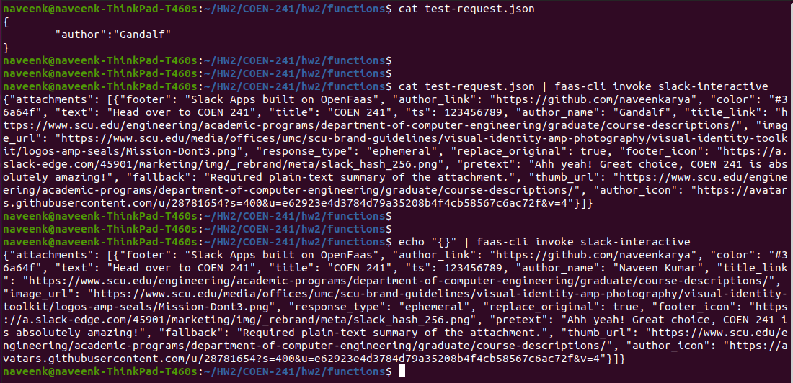
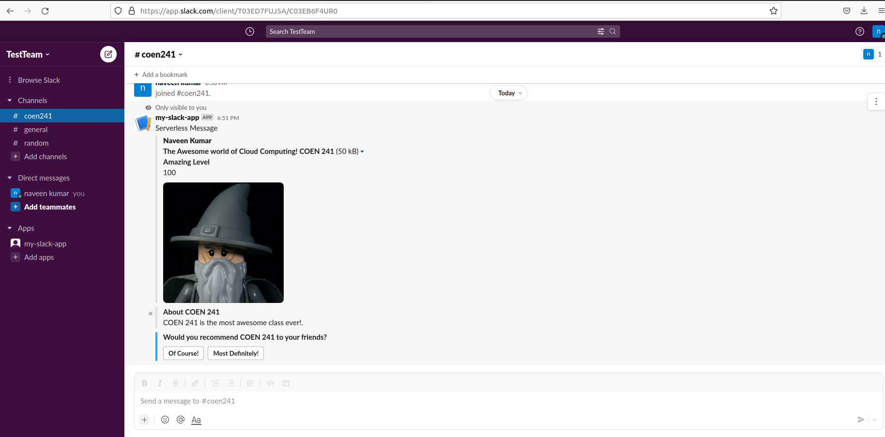
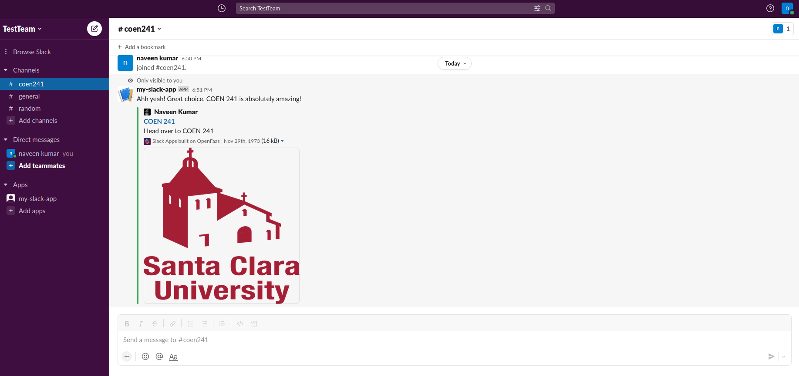

## Description of screenshots

### invoke-figlet.png: Execution of figlet function.

### journalctl.png: faasd logs using journalctl.

### openfaas-gateway.png: Gateway UI after deploying all the functions.

### slack-request.png: Execution of slack-request function.

### slack-interactive.png: Execution of slack-interactive function.

### author-name-from-input.png: Taking author name from input request instead of hardcoding it.

### slack-app-slack-request.png: Screenshot of slack app using the slash function (slack-request)

### slack-app-slack-interactive.png: Screenshot of slack app using the interactive function (slack-interactive)

